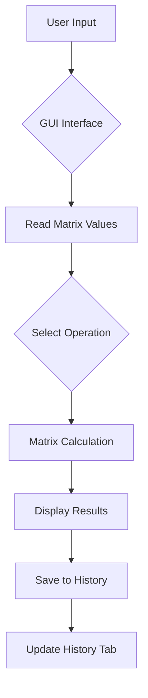

# 🧮 Kalkulator Matriks

<div align="center">


**Aplikasi kalkulator matriks dengan GUI modern dan sistem penyimpanan history**

[Fitur](#-fitur) • [Instalasi](#-instalasi) • [Penggunaan](#-penggunaan) • [Dokumentasi](#-dokumentasi)

</div>

## 📋 Daftar Isi

- [Gambaran Umum](#-gambaran-umum)
- [Fitur](#-fitur)
- [Instalasi](#-instalasi)
- [Penggunaan](#-penggunaan)
- [Dokumentasi](#-dokumentasi)
- [Contoh Penggunaan](#-contoh-penggunaan)
- [FAQ](#-faq)
- [Troubleshooting](#-troubleshooting)

## 🚀 Gambaran Umum

**Kalkulator Matriks** adalah aplikasi yang powerful dengan antarmuka grafis modern yang dibangun menggunakan Java Swing. Aplikasi ini tidak hanya melakukan operasi matriks dasar, tetapi juga dilengkapi dengan sistem penyimpanan history otomatis, GUI yang user-friendly, dan architecture yang terstruktur.

### ✨ Highlights

- 🎨 **GUI Modern** dengan tema warna yang harmonis
- 💾 **Penyimpanan Otomatis** history operasi ke file
- 🧮 **Multiple Operations** perkalian, penjumlahan, pengurangan
- 📊 **Tabbed Interface** untuk organisasi yang rapi
- 🚀 **Multi-file Architecture** code yang terstruktur
- 📁 **Export History** ke file teks

## 🌟 Fitur

### 🧮 Core Operations
- **Perkalian Matriks** - Operasi perkalian matriks 2x2
- **Penjumlahan Matriks** - Operasi penjumlahan matriks
- **Pengurangan Matriks** - Operasi pengurangan matriks
- **Input Validation** - Validasi input angka

### 💾 Data Management
- **Auto-save History** - Setiap operasi langsung tersimpan
- **File Storage** - Penyimpanan ke `history_matriks.txt`
- **History Management** - Kelola riwayat operasi
- **Clear History** - Hapus history dengan konfirmasi
- **50 Entri Maximum** - Batasan penyimpanan otomatis

### 🎨 GUI Features
- **Modern Interface** - Desain GUI yang intuitif
- **Color Coding** - Warna berbeda untuk matriks A dan B
- **Tabbed Navigation** - Kalkulator dan History terpisah
- **Real-time Results** - Hasil langsung ditampilkan
- **Responsive Design** - Adaptif berbagai ukuran layar
- **Hover Effects** - Feedback visual pada button

### ⚡ Advanced Features
- **Error Handling** - Penanganan error yang elegan
- **Input Clearing** - Reset input dengan satu klik
- **Timestamp** - Waktu setiap operasi tercatat
- **Formatted Output** - Tampilan matriks yang rapi

## 📥 Instalasi

### Prerequisites

- Java 8 atau lebih tinggi
- Java Development Kit (JDK)
- Terminal/Command Prompt

### Step-by-Step Installation

1. **Download Source Code**
   ```bash
   # Clone atau download file source code
   # Pastikan memiliki 4 file: Main.java, Matriks.java, MatriksGUI.java, HistoryManager.java
   ```

2. **Buat Folder Project**
   ```bash
   mkdir matriks-calculator
   cd matriks-calculator
   # Taruh semua file .java di folder ini
   ```

3. **Compile Program**
   ```bash
   # Compile semua file Java
   javac *.java
   ```

4. **Verifikasi Instalasi**
   ```bash
   # Jika compile berhasil, akan terbentuk file .class
   ls *.class
   ```

### Quick Install (Windows)
```bash
# Buka Command Prompt di folder project
javac *.java
java Main
```

## 🎮 Penggunaan

### Menjalankan Aplikasi

```bash
# Pastikan sudah di folder yang berisi file .class
java Main
```

### Basic Usage

1. **Input Matriks**
   - Masukkan nilai untuk Matriks A (4 angka)
   - Masukkan nilai untuk Matriks B (4 angka)
   - Nilai default: 0

2. **Pilih Operasi**
   - Klik tombol **Perkalian** untuk perkalian matriks
   - Klik tombol **Penjumlahan** untuk penjumlahan matriks  
   - Klik tombol **Pengurangan** untuk pengurangan matriks
   - Klik tombol **Clear** untuk reset input

3. **Lihat Hasil**
   - Hasil langsung muncul di area "Hasil Operasi"
   - History otomatis tersimpan

### Navigasi Tab

- **Tab Kalkulator** - Untuk operasi matriks
- **Tab History** - Untuk melihat riwayat operasi

### Keyboard Shortcuts

| Action | Method |
|--------|---------|
| Operasi Matriks | Klik tombol |
| Clear Input | Klik tombol Clear |
| Refresh History | Klik tombol Refresh |
| Clear History | Klik tombol Clear History |

## 📚 Dokumentasi

### Workflow



### File Descriptions

| File | Description |
|------|-------------|
| `Main.java` | Entry point, menjalankan aplikasi GUI |
| `Matriks.java` | Class untuk operasi matriks dan perhitungan |
| `MatriksGUI.java` | Antarmuka pengguna dengan Java Swing |
| `HistoryManager.java` | Mengelola penyimpanan dan load history |


## 💡 Contoh Penggunaan

### Basic Matrix Operations

**Input:**
```
Matriks A: [1 2]   Matriks B: [5 6]
           [3 4]              [7 8]
```

**Operasi Perkalian:**
```java
Matriks A = new Matriks(new int[][]{{1,2},{3,4}});
Matriks B = new Matriks(new int[][]{{5,6},{7,8}});
Matriks hasil = Matriks.perkalian(A, B);
// Hasil: [19 22]
//        [43 50]
```

**Operasi Penjumlahan:**
```java
Matriks hasil = Matriks.penjumlahan(A, B);
// Hasil: [6 8]
//        [10 12]
```

**Operasi Pengurangan:**
```java
Matriks hasil = Matriks.pengurangan(A, B);
// Hasil: [-4 -4]
//        [-4 -4]
```

### History Format

```text
Waktu: Mon Dec 04 14:30:15 ICT 2023
Operasi: Perkalian
Matriks A:
[1 2]
[3 4]
Matriks B:
[5 6]
[7 8]
Hasil:
[19 22]
[43 50]
========================================
```

## ❓ FAQ

### Q: Java version berapa yang diperlukan?
**A:** Java 8 atau lebih tinggi. Tested pada Java 8, 11, 17.

### Q: Bagaimana cara backup history?
**A:** File `history_matriks.txt` otomatis dibuat dan bisa di-copy manual.

### Q: Bisakah mengubah ukuran matriks?
**A:** Saat ini fixed 2x2, tapi code structure mudah di-extend.

### Q: File history disimpan di mana?
**A:** Di folder yang sama dengan aplikasi, nama: `history_matriks.txt`

### Q: Bagaimana reset semua data?
**A:** Hapus file `history_matriks.txt` atau gunakan Clear History.

### Q: Apakah support operasi matriks lain?
**A:** Bisa ditambah mudah, lihat section Pengembangan.

---

<div align="center">

**⭐ Jika project ini membantu, jangan lupa beri bintang! ⭐**

[Kembali ke Atas](#-kalkulator-matriks)

---


</div>